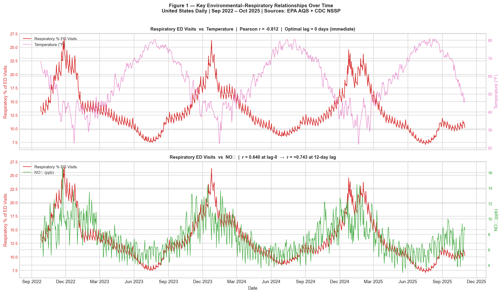
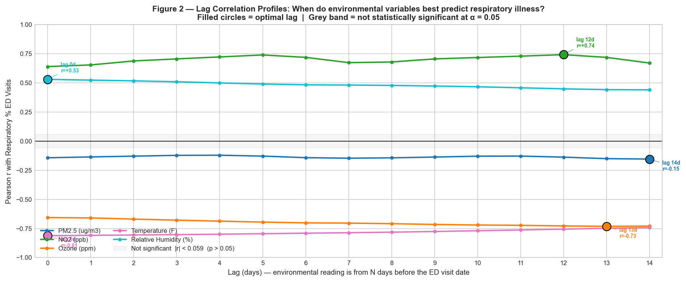
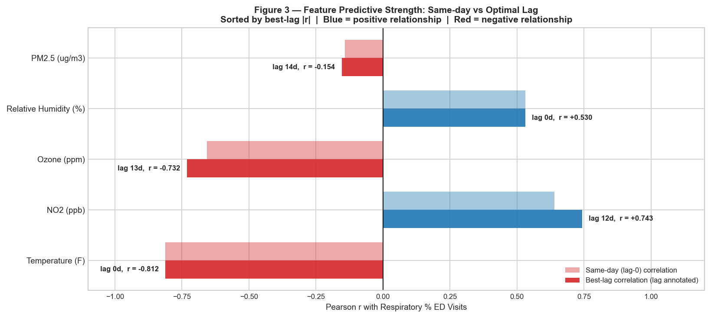
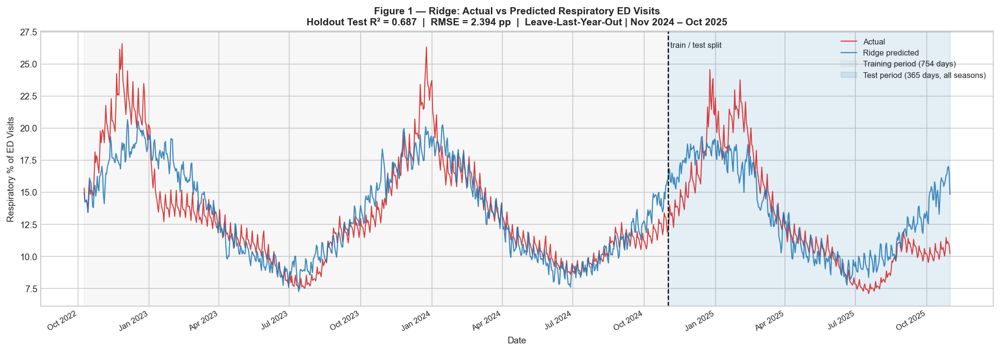
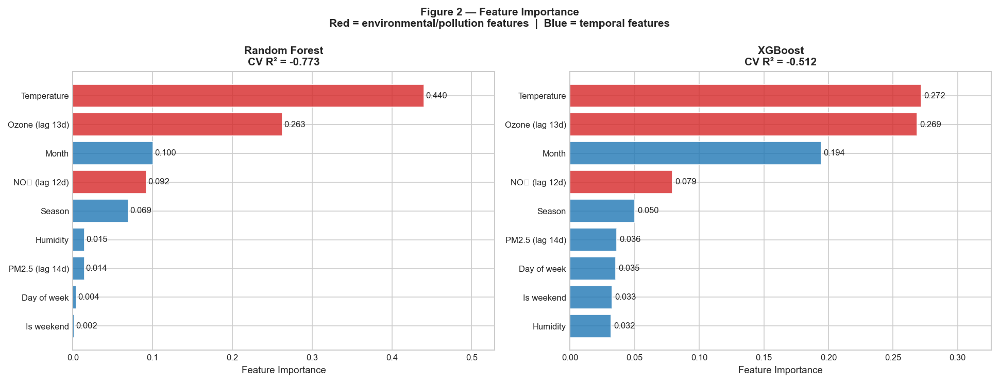
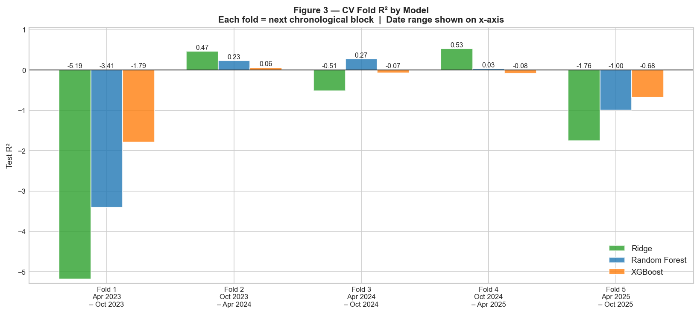

# Respiratory Disease Prediction from Environmental Factors

**Team:** Gowrav Lakshmipathy · Priya Dilip Bajaria · Nandini Nandan Narvekar

---

# Aim

Every winter, emergency departments across the United States see a rise in respiratory illness cases, while cases decrease during the summer. This project aims to predict how severe respiratory illness burden will be on a given day using environmental data such as temperature, air pollution, and humidity.

The target variable is `pct_respiratory`, which represents the daily percentage of U.S. emergency department visits classified as Acute Respiratory Illness (ARI) by the CDC’s National Syndromic Surveillance Program. Since this value ranges from about 7% in summer to 27% in winter, the project treats the task as a supervised regression problem.

A reliable prediction model can help hospitals plan staffing, support public health advisories, and identify which environmental factors are most strongly associated with respiratory illness.


> **Scope note:** The original proposal targeted New York City. NYC's respiratory data is only available as monthly aggregates (NYC EpiQuery), not daily. The CDC NSSP dataset provides complete daily national coverage from September 2022 onward, and EPA AQS averages across 2,000+ monitoring stations at the national level a methodologically sound national-to-national pairing.

---

## Quickstart

```bash
git clone <repo-url>
cd cs506-project
make run
```

`make run` creates a Python virtual environment, installs all dependencies from `requirements.txt`, and executes `eda.ipynb` followed by `models.ipynb`. The cleaned processed CSVs (`data/processed/`) are already committed to the repo there is no need to download or process any raw data.

```bash
make test          # run 12 pytest smoke tests (~1 second)
make help          # list all available Makefile targets
```

**To reproduce everything from raw data** (optional EPA files are 200–300 MB each):

```bash
make data          # prints download instructions for all 6 raw datasets with URLs
make all           # full pipeline: profiling → cleaning → eda → models
```

Individual stages can also be run separately:

```bash
make install       # create venv and install dependencies only
make profiling     # run data_profiling.ipynb   (requires raw data)
make cleaning      # run data_cleaning.ipynb    (requires raw data)
make eda           # run eda.ipynb
make models        # run models.ipynb
make clean         # remove venv and generated outputs for a full reset
```

---

## Repository Structure

```
cs506-project/
├── data_profiling.ipynb       # inspect all 6 raw datasets, document every issue found
├── data_cleaning.ipynb        # execute cleaning decisions → master_daily.csv
├── eda.ipynb                  # correlation analysis, lag profiles, feature engineering
├── models.ipynb               # train Ridge / RF / XGBoost, evaluate, produce figures
│
├── data/
│   ├── raw/                   # not in git — see: make data
│   │   ├── pm25/              # daily_88101_YYYY.csv (2022–2025)
│   │   ├── no2/               # daily_42602_YYYY.csv
│   │   ├── ozone/             # daily_44201_YYYY.csv
│   │   ├── temperature/       # daily_TEMP_YYYY.csv
│   │   ├── humidity/          # daily_RH_DP_YYYY.csv
│   │   └── respiratory/       # nssp_respiratory.csv
│   └── processed/             # committed to git (~600 KB total)
│       ├── master_daily.csv   # 1,133 rows × 12 columns — merged clean dataset
│       └── features_daily.csv # 1,119 rows × 16 columns — engineered features
│
├── outputs/figures/           # all plots produced by eda.ipynb and models.ipynb
├── tests/test_pipeline.py     # pytest smoke tests
├── .github/workflows/tests.yml
├── Makefile
└── requirements.txt
```

---

## Data Sources

Six datasets were collected and merged. Five come from the EPA's Air Quality System (AQS) pre-generated data files, one from the CDC.

| Dataset | Source | Raw size | Temporal resolution |
|---|---|---|---|
| PM2.5 (fine particulate) | EPA AQS `daily_88101_YYYY.csv` | 2,915,841 rows | One station per day |
| NO₂ (nitrogen dioxide) | EPA AQS `daily_42602_YYYY.csv` | 562,605 rows | One station per hour |
| Ozone | EPA AQS `daily_44201_YYYY.csv` | 1,412,282 rows | One station per 8-hr window |
| Temperature | EPA AQS `daily_TEMP_YYYY.csv` | 1,184,025 rows | One station per hour |
| Relative Humidity | EPA AQS `daily_RH_DP_YYYY.csv` | 579,258 rows | One station (RH + Dew Point mixed) |
| Respiratory ARI | CDC NSSP | 259,896 rows | One pathogen × geography per day |

Each EPA dataset contains one row per monitoring station per time period, covering thousands of stations across the US. Aggregating to a single national daily value reduces millions of rows to 1,133 daily observations one per calendar day from September 25, 2022 to October 31, 2025.

---

## Data Processing

The data processing pipeline uses two notebooks. data_profiling.ipynb first reviews each raw dataset and documents all data quality issues without changing the data. Then, data_cleaning.ipynb applies the cleaning decisions identified during profiling.
This makes the process consistent and reproducible because every cleaning step is based on a documented issue rather than an improvised decision.

### PM2.5

8,306 readings had negative values, which are physically impossible for a concentration, and were likely caused by sensor calibration drift. These readings were dropped. For extreme high values, using a hard threshold would have been incorrect because the 192 readings above 200 µg/m³ corresponded to the June to September 2023 Canadian wildfire smoke events that affected large parts of the U.S. These were real, validated measurements. A 99.5th percentile cap at the station level preserved these events while trimming only instrument artifacts at the very tail of the distribution.


### Temperature

One temperature reading of −1,177.67°F was physically impossible and was treated as a sensor error. In addition, 79 readings above 140°F were likely caused by surface heat effects from sensors placed in very hot locations, such as rooftops.
These values were removed using physical limits: below −80°F and above 140°F. Physical limits were used instead of percentile caps because these errors were clearly unrealistic based on temperature physics, not just statistically unusual.

### Humidity

The raw EPA humidity file contained two different measurements: relative humidity and dew point. Relative humidity is measured as a percentage, while dew point is measured in degrees Fahrenheit and can be negative.
Because of this, averaging the file without filtering would create incorrect results. For example, the raw data showed a minimum value of −25, which looked like an invalid humidity value but was actually a dew point reading.
To fix this, the data was first filtered to keep only rows where `Parameter Name == "Relative Humidity"` before any aggregation was done.

### Respiratory (CDC NSSP)

The CDC file included multiple pathogens, such as COVID, flu, and RSV, along with different geographic levels such as states, regions, and the national level. To create the target variable, the data was filtered to `pathogen == "ARI"` and `geography == "United States"` using exact string matching.
ARI stands for Acute Respiratory Illness and represents the broadest respiratory category in the NSSP data. It includes respiratory emergency department visits regardless of the specific pathogen. Individual pathogen rows were not combined with ARI because that would double-count the same visits.
The target variable had no invalid values or missing days. A weekly pattern was observed in emergency department usage, with slight differences between weekdays and weekends. This pattern was kept because it represents real behavior rather than noise.


### Merge

All six cleaned datasets were merged by date using an inner join. The final study period runs from September 25, 2022 to October 31, 2025.
This date range was determined by the available data: the CDC respiratory data sets the starting date, and the temperature data sets the ending date. Since there were no missing days within this period, the merge kept all 1,133 daily records with zero missing values.


---

## Exploratory Data Analysis

### Time series: temperature, NO₂, and respiratory illness



This plot shows how closely temperature is associated with respiratory illness. Cold winters push respiratory ED visits up to 24-27% of all visits and warm summers bring that down to 7-9%. The relationship is consistent across all three years in the dataset. NO₂ follows a similar seasonal pattern for a different reason: more combustion-based heating and traffic in winter increases nitrogen dioxide, and higher NO₂ is associated with more respiratory illness.

### Lag correlation profiles



For each feature, we computed Pearson r between the lagged feature value and the same-day illness value at lags 0 through 14 days. The significance threshold shown is ±1.96/√1105 ≈ ±0.059.

Temperature and humidity have flat lag profiles - their correlation with illness is equally strong whether you look at the same day or 14 days prior, because both variables reflect the same underlying seasonal position. Breathing cold air today is as predictive as cold air 14 days ago, because both indicate "it is winter."

NO₂ and ozone are different: their correlations peak at 12 and 13 days respectively, improving from r = +0.64 and r = −0.66 at lag 0 to r = +0.74 and r = −0.73 at their optimal lags. The delay is consistent with the time from pollutant exposure to airway inflammation to ED visit. That said, part of this improvement reflects shared seasonality (NO₂ at day N looks similar to day N+12 because both fall in the same winter) rather than a purely causal 13-day mechanism.

PM2.5 shows almost no correlation at any time lag (r ≈ −0.14), but the pattern is likely distorted by seasonal effects. The largest PM2.5 spikes in the data - mainly from the 2023 wildfire smoke events - happened during the summer, when respiratory illness is usually at its lowest. Because these two patterns move in opposite seasonal cycles, they end up partially canceling each other out, which hides any real impact PM2.5 might have.

### Feature correlation ranking



This chart compares same-day correlation vs best-lag correlation for each feature. For temperature and humidity, the two bars are nearly identical i.e. the lag doesn't help. For NO₂ and ozone, the lagged correlation is meaningfully stronger. PM2.5 barely registers in either case.

---

## Feature Engineering

The final feature set used for modeling:

| Feature | Type | Why included |
|---|---|---|
| `temperature` | Environmental | r = −0.812, strongest predictor, same-day |
| `humidity` | Environmental | r = +0.530, second strongest at lag 0 |
| `no2_lag12` | Environmental (lagged) | r = +0.743 at 12-day lag |
| `ozone_lag13` | Environmental (lagged) | r = −0.732 at 13-day lag |
| `pm25_lag14` | Environmental (lagged) | r ≈ −0.15, weak but included |
| `month_sin`, `month_cos` | Temporal (for Ridge) | Cyclic encoding — see below |
| `month`, `season_num` | Temporal (for trees) | Raw ordinal for threshold-based splits |
| `day_of_week`, `is_weekend` | Temporal | Weekly ED utilization pattern |

Lagging NO₂ by 12 days and ozone by 13 days means using the feature values from 12-13 days earlier to predict today's illness - which corresponds to the observed optimal correlations and the plausible biological delay.

Applying the 14-day lag to PM2.5 drops the first 14 rows of the dataset (no prior values available), reducing the feature set from 1,133 to **1,119 rows**.

**Cyclic month encoding** helps address problem with using raw month (1-12) as a feature for linear models. A linear model would treat January (1) and December (12) as 11 units apart - the maximum possible distance - when in reality they are adjacent months in the seasonal cycle. Encoding month as `sin(2π·month/12)` and `cos(2π·month/12)` maps all 12 months onto a unit circle where December and January are just 30° apart. The two-component encoding (sin and cos together) allows fitting a sinusoid of arbitrary phase, which is exactly the right structure for an annual cycle. Tree models don't need this because they split on thresholds and can express "month ≤ 2 or month ≥ 11" in a single decision.

---

## Modeling

### Evaluation strategy

A random k-fold cross-validation would shuffle the time series, allowing the model to train on 2024 data while predicting 2022 - that's leaking future information into the past. An 80/20 split by row count places the split in March 2025, making the test set spring and summer only. All three models trained on fall/winter-dominant data predict winter-level values (~18-20%) for summer actuals (~8-10%), giving R² = −0.09. That looks like failure, but it's an evaluation problem: the test distribution was never seen during training.

The solution is a **leave-last-year-out holdout**: split at October 31, 2024 so the training set covers October 2022 - October 2024 (754 days, two full annual cycles) and the test set covers November 2024 - October 2025 (365 days, all 12 months). Two full cycles of training means the model has seen every season before testing. A full-year test set means R² is measured across all seasonal regimes — winter peaks, spring declines, summer troughs, fall recovery.

A 5-fold `TimeSeriesSplit` is run alongside as a robustness diagnostic. Each fold trains on all data prior to the test window (expanding window, not rolling). The fold R² results confirm that models succeed when the test fold's season matches training data and fail when it doesn't — the pattern is consistent across all three models, proving the failure is structural rather than model-specific.

### Models

**Ridge Regression** with cyclic month encoding. Ridge adds an L2 penalty to the OLS objective (`Σ(y − Xβ)² + α·Σβ²`), which shrinks correlated feature coefficients toward each other rather than producing unstable large-magnitude coefficients. Temperature, ozone, and month are all seasonally correlated, making Ridge more stable than plain OLS. `RidgeCV` selects the regularization strength via internal leave-one-out CV across [0.1, 1, 10, 100, 1000]. Features are standardized inside each evaluation fold - fit on training data only, applied to test - to ensure the regularization penalty is scale-fair.

**Random Forest** with 300 trees, `max_depth=8`, `min_samples_leaf=10`, `max_features=0.6`. Tree models can capture non-linear interactions and seasonal thresholds (e.g., "if month ≤ 2 AND temperature < 40°F, predict high illness") without needing explicit encoding. `max_depth=8` and `min_samples_leaf=10` limit individual tree complexity on 1,119 training rows; `max_features=0.6` ensures the 300 trees are sufficiently decorrelated by seeing only 60% of features at each split.

**XGBoost** with `n_estimators=300`, `learning_rate=0.05`, `max_depth=4`. Gradient boosting trains trees sequentially, each correcting the residuals of all previous trees. Shallower trees (`max_depth=4`) and small learning rate (`0.05`) provide regularization; `subsample=0.8` and `colsample_bytree=0.8` add stochastic noise to further reduce overfitting.

### Results

| Model | Holdout R² | RMSE (pp) | MAE (pp) |
|---|---|---|---|
| **Ridge Regression** | **0.687** | **2.394** | **1.880** |
| Random Forest | 0.570 | 2.806 | 2.126 |
| XGBoost | 0.548 | 2.875 | 2.154 |



Ridge explains 68.7% of variance in respiratory illness on a full unseen year. RMSE of 2.39 percentage points means predictions are off by about ±2.4 pp on a target that ranges 7-27%. For comparison, predicting the training mean (13.24%) every day would give RMSE ≈ 4.5 pp - Ridge cuts that roughly in half.

The dominant signal in this dataset is the annual seasonal cycle, which explains ~81.4% of the variance when combined with temperature and cyclic month encoding. Ridge's simple linear structure captures this cleanly and generalizes across years because the seasonal cycle repeats reliably. The tree models have more capacity but use it to memorize year-specific patterns - Random Forest's train R² is 0.91, XGBoost's is 0.99, both far above their test R², while Ridge's train R² is 0.76. With only 1,119 training rows and a dominant linear signal, extra model complexity hurts rather than helps.



Temperature accounts for 44% of Random Forest's feature importance and 27% of XGBoost's gain - nearly half the model's explanatory power in a single variable. Ozone (lagged 13 days) is second at ~26% in both tree models. PM2.5 contributes 0.7% in Random Forest, confirming the near-zero correlation found in EDA.



The fold-by-fold CV results show a clear seasonal pattern: folds 2 and 4 (fall/winter test sets) return positive R² across all models; folds 1, 3, and 5 (spring/summer test sets) return negative R². The leave-last-year-out holdout ensures the test period covers all seasons.

---

## Tests

```bash
make test
```

12 pytest smoke tests in `tests/test_pipeline.py` verify the pipeline without re-running any notebooks:

- **Data integrity:** `master_daily.csv` is exactly (1133, 12), has no missing values, date range is Sep 25 2022 - Oct 31 2025, `pct_respiratory` stays within a plausible 5-35% range, temperature stays 0-100°F (valid national daily average range), humidity stays 0-100%, all pollutants are non-negative
- **Feature engineering:** `features_daily.csv` has exactly 1,119 rows (1,133 − 14 dropped for lag NaNs), `sin²(month) + cos²(month) = 1` for every row, `pm25_lag14` on the first row exactly matches the PM2.5 value from 14 days earlier in the master dataset
- **Model:** Ridge holdout R² exceeds 0.5 on the leave-last-year-out split

The GitHub Actions workflow (`.github/workflows/tests.yml`) runs these automatically on every push and pull request. Tests complete in under 2 seconds since they read only the committed CSVs.